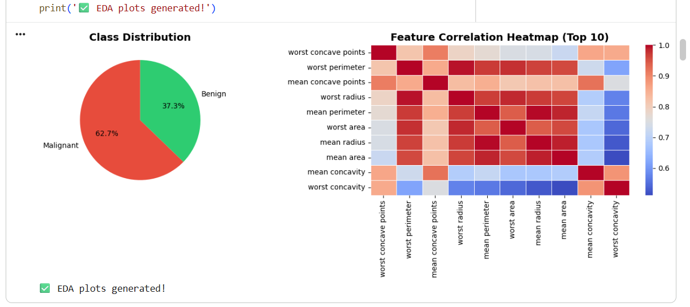
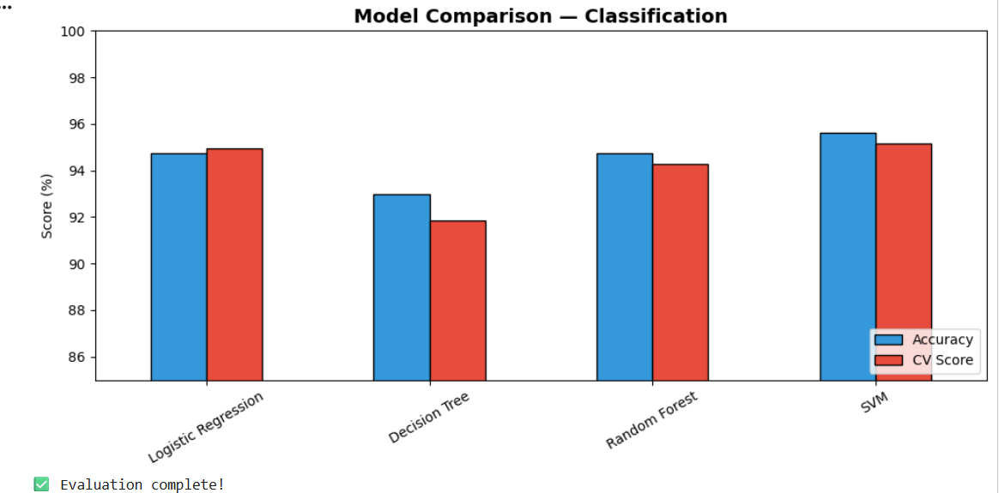
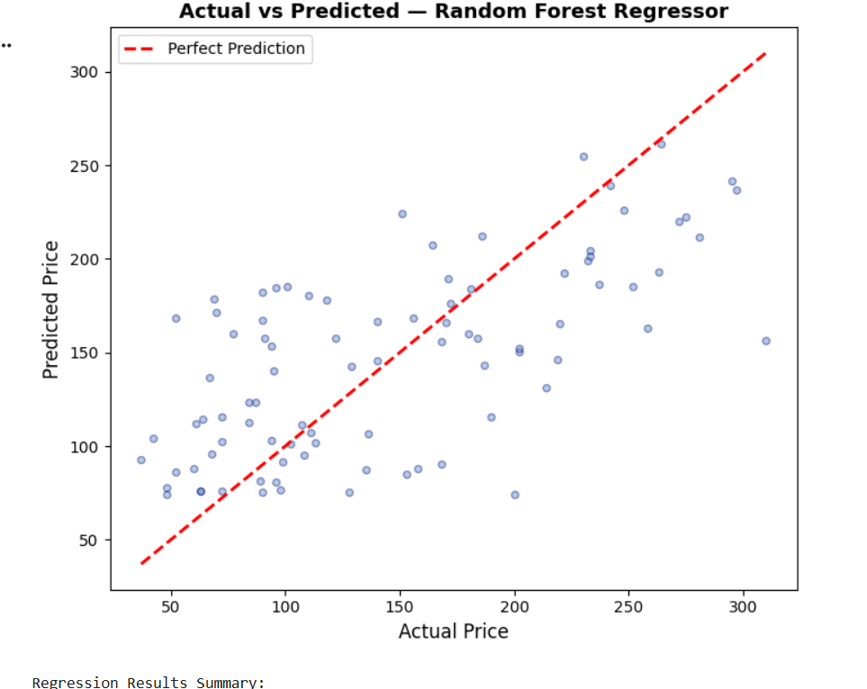
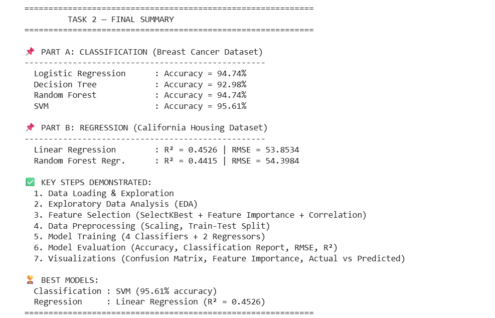

# CODTECH Task 2 - Predictive Analysis Using Machine Learning

## Internship Details

**Company:** CODTECH IT SOLUTION  
**Name:** DEVENDRA KAGE  
**Intern ID:** CTIS9127  
**Domain:** DATA ANALYSIS  
**Duration:** 4 weeks  
**Mentor:** NEELA SANTOSH  

## Project Overview

This repository contains the completed Task 2 project for the CODTECH Data Analysis internship. The task focuses on predictive analysis using machine learning techniques, covering both classification and regression workflows. The notebook demonstrates how raw datasets can be loaded, explored, preprocessed, modeled, evaluated, and visualized in a complete end-to-end machine learning pipeline.

## Repository Structure

```text
CODTECH_Task2_Predictive_Analysis/
├── README.md
├── notebooks/
│   └── Task2_Predictive_Analysis_ML_FIXED.ipynb
└── images/
    ├── 01_eda_plots.png
    ├── 02_model_comparison.png
    ├── 03_regression_actual_vs_predicted.png
    └── 04_final_summary.png
```

## Task Description

The objective of this task is to perform predictive analysis using machine learning models and to present the results in a clear, structured, and reproducible format. The project is divided into two major analytical parts. The first part is a classification problem using the Breast Cancer dataset, where the goal is to classify whether a tumor is malignant or benign based on medical diagnostic measurements. The second part is a regression problem using the California Housing dataset, where the goal is to predict continuous housing price values based on numerical housing and location-related features. Together, these two parts demonstrate the practical use of supervised machine learning for both categorical and numerical prediction problems.

The workflow begins with data loading and exploration. In this stage, the datasets are imported, inspected, and understood using basic checks such as feature names, target values, class distribution, and dataset shape. Exploratory Data Analysis is then performed to identify patterns, relationships, and important trends. For the classification dataset, the class distribution plot helps show the balance between malignant and benign cases. The correlation heatmap highlights the relationships among important medical features and supports feature understanding. This is an important step because machine learning models perform better when the analyst understands the behavior of the input variables before training.

After exploration, feature selection and preprocessing are applied. Feature selection is demonstrated through techniques such as correlation analysis, SelectKBest, and model-based feature importance. These methods help identify which variables contribute the most to prediction. Preprocessing includes splitting the dataset into training and testing sets and applying scaling where required. Scaling is especially important for algorithms such as Logistic Regression and SVM because these models can be affected by differences in feature magnitude. A clean preprocessing workflow improves model reliability and ensures that the evaluation is fair.

The classification section trains and compares four machine learning algorithms: Logistic Regression, Decision Tree, Random Forest, and Support Vector Machine. Each model is evaluated using accuracy and cross-validation score. This comparison helps identify which model generalizes best instead of only performing well on a single test split. According to the final summary, SVM performs the best for classification with an accuracy of 95.61 percent, while Logistic Regression and Random Forest also produce strong results. Decision Tree performs slightly lower, which is common because single decision trees can overfit or underperform compared with ensemble and margin-based methods.

The regression section applies Linear Regression and Random Forest Regressor to the California Housing dataset. These models are evaluated using R-squared and Root Mean Squared Error. R-squared shows how much variance in the target variable is explained by the model, while RMSE indicates the average prediction error in the original target scale. The final output shows that Linear Regression gives the better R-squared value of 0.4526, while Random Forest Regressor gives an R-squared value of 0.4415. The actual versus predicted scatter plot provides a visual way to inspect regression performance by comparing predicted prices with true prices. The red diagonal line represents perfect prediction, and points closer to the line indicate better estimates.

This task also emphasizes the importance of visualization in machine learning projects. Visual outputs make it easier to explain model performance, understand feature behavior, and communicate findings to others. The repository includes all important result screenshots so that the final project can be reviewed without rerunning the notebook immediately. The notebook itself remains available in the `notebooks` folder for full reproducibility and further experimentation. Overall, this task demonstrates the complete machine learning process from data exploration to model evaluation and final reporting. It shows how classification and regression models can be built, compared, and interpreted in a professional data analysis workflow.

## Technologies Used

- Python
- Jupyter Notebook
- Pandas
- NumPy
- Matplotlib
- Seaborn
- Scikit-learn

## Key Steps Demonstrated

1. Data loading and initial exploration
2. Exploratory Data Analysis
3. Feature selection using correlation, SelectKBest, and feature importance
4. Data preprocessing with scaling and train-test splitting
5. Model training for classification and regression
6. Model evaluation using accuracy, cross-validation, R-squared, and RMSE
7. Visualization of class distribution, feature correlation, model comparison, and prediction results

## Final Results Summary

### Part A: Classification - Breast Cancer Dataset

| Model | Accuracy |
| --- | ---: |
| Logistic Regression | 94.74% |
| Decision Tree | 92.98% |
| Random Forest | 94.74% |
| SVM | 95.61% |

**Best Classification Model:** SVM with 95.61% accuracy.

### Part B: Regression - California Housing Dataset

| Model | R-squared | RMSE |
| --- | ---: | ---: |
| Linear Regression | 0.4526 | 53.8534 |
| Random Forest Regressor | 0.4415 | 54.3984 |

**Best Regression Model:** Linear Regression with R-squared value of 0.4526.

## Output

### Image 1 - EDA Plots

**Image Location:** `images/01_eda_plots.png`



### Image 2 - Classification Model Comparison

**Image Location:** `images/02_model_comparison.png`



### Image 3 - Regression Actual vs Predicted

**Image Location:** `images/03_regression_actual_vs_predicted.png`



### Image 4 - Final Summary

**Image Location:** `images/04_final_summary.png`



**All output image files are located in the `images/` folder of this repository.**
